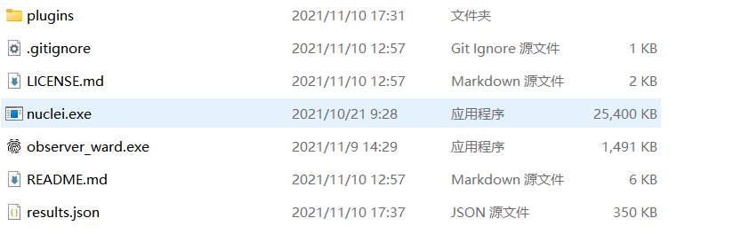

[中文简体](./README.md)

# ObserverWard_0x727

| 类别  | 说明                                                     |
|-----|--------------------------------------------------------|
| 作者  | [三米前有蕉皮](https://github.com/cn-kali-team)              |
| 团队  | [0x727](https://github.com/0x727) 未来一段时间将陆续开源工具        |
| 定位  | 社区化[指纹库](https://github.com/0x727/FingerprintHub)识别工具。 |
| 语言  | Rust                                                   |
| 功能  | 命令行Web指纹识别工具                                           |

### 1. 源码手动安装

```bash
git clone https://github.com/0x727/ObserverWard_0x727
cd ObserverWard_0x727
cargo build --target  x86_64-unknown-linux-musl --release --all-features
```

- 更多安装细节请查看当前项目的Actions自动化编译构建流程[文件](https://github.com/0x727/ObserverWard_0x727/blob/main/.github/workflows/basic.yml)。

### 2. 下载二进制安装

- 因为前期更新比较频繁，没有使用tags发布版本，每次更新代码都会自动重新编译发布到`default`版本，所以`default`永远是最新的版本。
- 看到是前几天发布的不要犹豫，下载就是最新的。
- [发行版本](https://github.com/0x727/ObserverWard_0x727/releases)下载页面。

## 使用方法

```bash
➜  ~ ./observer_ward -h
ObserverWard 0.0.1
author: Kali-Team

USAGE:
    observer_ward [FLAGS] [OPTIONS]

FLAGS:
    -c, --csv                   Export to the csv file or Import form the csv file
    -f, --file                  Read the target from the file
    -h, --help                  Prints help information
    -j, --json                  Export to the json file or Import form the json file
        --service               Using nmap fingerprint identification service (slow)
        --stdin                 Read url(s) from STDIN
    -t, --target                The target URL(s) (required, unless --stdin used)
    -u, --update_fingerprint    Update web fingerprint
        --update_plugins        Update nuclei plugins
        --update_self           Update self
    -V, --version               Prints version information

OPTIONS:
        --plugins <plugins>    Calling plugins to detect vulnerabilities
        --proxy <proxy>        Proxy to use for requests (ex: [http(s)|socks5(h)]://host:port)
        --thread <thread>      Number of concurrent threads. [default: 100]
        --timeout <timeout>    Set request timeout. [default: 10]
        --verify <verify>      Validate the specified yaml file
        --webhook <webhook>    Send results to webhook server (ex: https://host:port/webhook)
```

### 更新指纹

- 使用`-u`参数从指纹库中更新指纹，也可以自己从[指纹库项目](https://0x727.github.io/FingerprintHub/web_fingerprint_v3.json)下载到当前目录。

```bash
➜  ~ ./observer_ward_amd64 -u    
Complete web_fingerprint_v3.json update: web_fingerprint_v3.json file size => 949222
```

### 验证指纹是否有效

- `--verify`指定要验证的指纹yaml文件路径，`-t`指定要识别的目标。

```bash
➜  ~ ./observer_ward --verify verification.yaml -t https://httpbin.org
[ https://httpbin.org |["swagger"] | 9593 | 200 | httpbin.org ]
Important technology:

+---------------------+---------+--------+-------------+-------------+----------+
| url                 | name    | length | status_code | title       | priority |
+=====================+=========+========+=============+=============+==========+
| https://httpbin.org | swagger | 9593   | 200         | httpbin.org | 5        |
+---------------------+---------+--------+-------------+-------------+----------+
```

### 单个目标识别

```bash
➜  ~ ./observer_ward -t https://httpbin.org
[ https://httpbin.org |["swagger"] | 9593 | 200 | httpbin.org ]
Important technology:

+---------------------+---------+--------+-------------+-------------+----------+
| url                 | name    | length | status_code | title       | priority |
+=====================+=========+========+=============+=============+==========+
| https://httpbin.org | swagger | 9593   | 200         | httpbin.org | 5        |
+---------------------+---------+--------+-------------+-------------+----------+
```


### 从文件获取要识别的目标

```bash
➜  ~ ./observer_ward -f target.txt
```


### 从标准输出获取识别目标

```bash
➜  ~ cat target.txt| ./observer_ward --stdin
```

- 结果和从文件获取的效果一样，这里不再截图展示。

### 导出结果到JSON文件

```bash
➜  ~ ./observer_ward -t https://httpbin.org -j result.json
[ https://httpbin.org |["swagger"] | 9593 | 200 | httpbin.org ]
Important technology:

+---------------------+---------+--------+-------------+-------------+----------+
| url                 | name    | length | status_code | title       | priority |
+=====================+=========+========+=============+=============+==========+
| https://httpbin.org | swagger | 9593   | 200         | httpbin.org | 5        |
+---------------------+---------+--------+-------------+-------------+----------+
➜  ~ cat result.json
[{"url":"https://httpbin.org","name":["swagger"],"priority":5,"length":9593,"title":"httpbin.org","status_code":200,"is_web":true,"plugins":[]}]
```

### 导出结果到CSV文件

```bash
➜  ~ ./observer_ward -t https://httpbin.org -c result.csv
[ https://httpbin.org |["swagger"] | 9593 | 200 | httpbin.org ]
Important technology:

+---------------------+---------+--------+-------------+-------------+----------+
| url                 | name    | length | status_code | title       | priority |
+=====================+=========+========+=============+=============+==========+
| https://httpbin.org | swagger | 9593   | 200         | httpbin.org | 5        |
+---------------------+---------+--------+-------------+-------------+----------+
➜  ~ cat result.csv 
url,name,length,status_code,title,priority
https://httpbin.org,swagger,9593,200,httpbin.org,5
```

### 调用Nuclei检测漏洞

- 如果需要使用`Nuclei`检测漏洞，需要首先安装`Nuclei`到当前目录，或者是加入环境变量里面，让`observe_ward`可以正常调用。
- 再下载[指纹库中的插件](https://github.com/0x727/FingerprintHub/tree/main/plugins)到当前目录下，或者使用`--update_plugins`插件。
- 如图：



- 在[指纹库](https://github.com/0x727/FingerprintHub/tree/main/plugins)中已经对部分组件的插件进行了分类，如果识别到的组件在`plugins`目录下存在和组件同名的文件夹，会对目标调用Nuclei使用匹配到的插件进行检测，存在漏洞会输出到屏幕。
- 因为经过测试在指纹识别过程中同时调用nuclei检测漏洞会影响Web指纹识别的效果，也会拉长识别的时间，所以选择识别完Web指纹后将结果保存到文件，再解析文件调用nuclei检测。
- 目前支持将Web指纹识别的结果保存为`json`和`csv`格式，所以只能解析这两种格式。

```bash
➜  ~ ./observer_ward_amd64 -t https://httpbin.org --csv result.csv --plugins 0x727/FingerprintHub/plugins  
 __     __     ______     ______     _____
/\ \  _ \ \   /\  __ \   /\  == \   /\  __-.
\ \ \/ ".\ \  \ \  __ \  \ \  __<   \ \ \/\ \
 \ \__/".~\_\  \ \_\ \_\  \ \_\ \_\  \ \____-
  \/_/   \/_/   \/_/\/_/   \/_/ /_/   \/____/
Community based web fingerprint analysis tool.
_______________________________________________
: https://github.com/0x727/FingerprintHub     :
: https://github.com/0x727/ObserverWard_0x727 :
 ----------------------------------------------
[ https://httpbin.org |["swagger"] | 9593 | 200 | httpbin.org ]
Important technology:

+---------------------+---------+--------+-------------+-------------+----------+
| url                 | name    | length | status_code | title       | priority |
+=====================+=========+========+=============+=============+==========+
| https://httpbin.org | swagger | 9593   | 200         | httpbin.org | 5        |
+---------------------+---------+--------+-------------+-------------+----------+
Important technology:

+---------------------+---------+--------+-------------+-------------+----------+------------+
| url                 | name    | length | status_code | title       | priority | plugins    |
+=====================+=========+========+=============+=============+==========+============+
| https://httpbin.org | swagger | 9593   | 200         | httpbin.org | 5        | swagger-api|
+---------------------+---------+--------+-------------+-------------+----------+------------+

```
- 同理`json`格式也可以。
```bash
➜  ~ ./observer_ward_amd64 -f target.txt --json result.json --plugins 0x727/FingerprintHub/plugins
```
## WebHook
```python
from flask import Flask, request

app = Flask(__name__)


@app.route("/webhook", methods=['POST'])
def xray_webhook():
    print(request.json)
    return 'ok'


if __name__ == '__main__':
    app.run()
```
- 开启webhook后，添加`--webhook`参数，将识别的结果发送到webhook服务器。
```shell
➜  ~ ./observer_ward_amd64 -f target.txt --webhook http://127.0.0.1:5000/webhook
```
## 提交指纹

- ObserverWard_0x727使用到的指纹规则全部来自[FingerprintHub](https://github.com/0x727/FingerprintHub)项目，如果需要获取指纹库和提交指纹规则，请查看[FingerprintHub](https://github.com/0x727/FingerprintHub)项目。

## 为ObserverWard_0x727做贡献

ObserverWard_0x727 是一个免费且开源的项目，我们欢迎任何人为其开发和进步贡献力量。

- 在使用过程中出现任何问题，可以通过 issues 来反馈。
- Bug 的修复可以直接提交 Pull Request 到 dev 分支。
- 如果是增加新的功能特性，请先创建一个 issue 并做简单描述以及大致的实现方法，提议被采纳后，就可以创建一个实现新特性的 Pull Request。
- 欢迎对说明文档做出改善，帮助更多的人使用 ObserverWard_0x727，特别是英文文档。
- 贡献代码请提交 PR 至 dev 分支，master 分支仅用于发布稳定可用版本。
- 如果你有任何其他方面的问题或合作，欢迎发送邮件至 0x727Team@gmail.com 。

## Stargazers over time

[](https://github.com/0x727/ObserverWard_0x727)