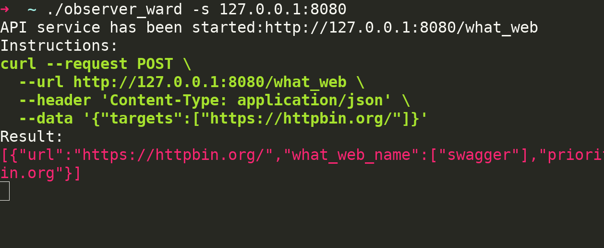
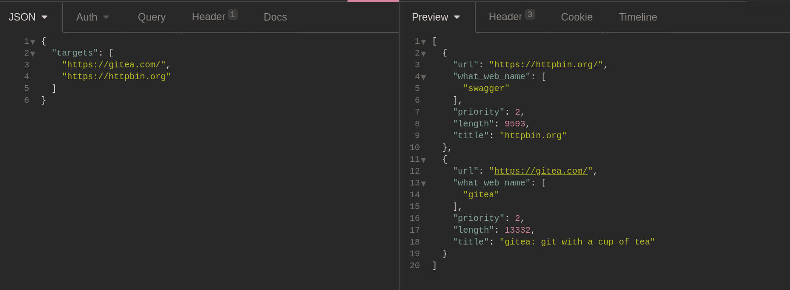
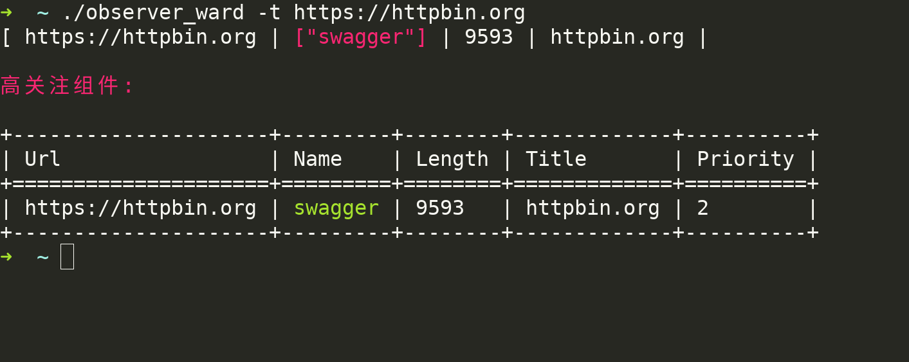
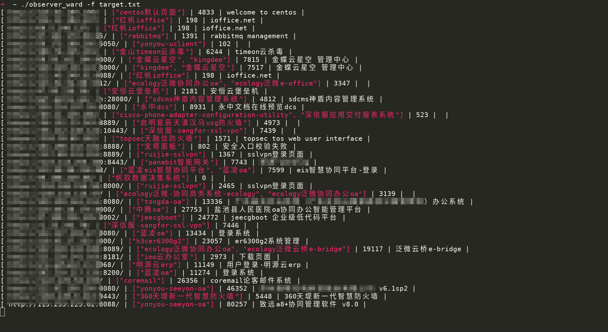
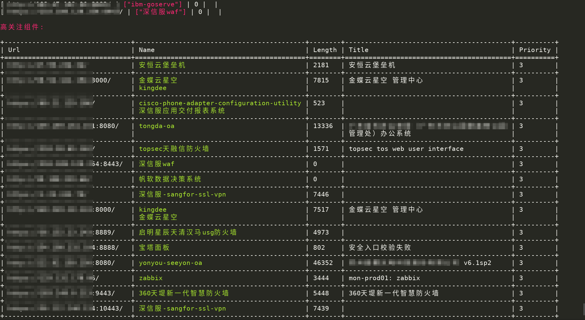

# ObserverWard_0x727

[English](./README_EN.md) | [中文简体](./README.md)

| category | describe |
| ---- | --- |
| author | [三米前有蕉皮](https://github.com/cn-kali-team) |
| team | [0x727](https://github.com/0x727) Open source tools will be available in the future. |
| what for? | Communalization [FingerprintHub](https://github.com/0x727/FingerprintHub) Identification tool. |
| language | Rust |
| feature | Command line,Custom request,API service web fingerprint identification tool. |

### 1. Installation of source code

```bash
git clone https://github.com/0x727/ObserverWard_0x727
cd ObserverWard_0x727
cargo build --target  x86_64-unknown-linux-musl --release --all-features
```

- For more installation details, please see the actions automatic compilation and construction process file of the
  current project [workflows](https://github.com/0x727/ObserverWard_0x727/blob/main/.github/workflows/basic.yml).

### 2. Download release binary installation

- [Release version](https://github.com/0x727/ObserverWard_0x727/releases) Download page.

## Usage:

```bash
➜  ~ ./observer_ward_amd64 -h
ObserverWard 0.0.1
author: Kali-Team

USAGE:
    observer_ward_amd64 [FLAGS] [OPTIONS]

FLAGS:
    -h, --help       Prints help information
        --stdin      Read url(s) from STDIN
    -u, --update     Update web fingerprint
    -V, --version    Prints version information

OPTIONS:
    -c, --csv <CSV>          Export to the csv file
    -f, --file <FILE>        Read the target from the file
    -j, --json <JSON>        Export to the json file
    -p, --proxy <PROXY>      Proxy to use for requests (ex: http(s)://host:port, socks5(h)://host:port)
    -s, --server <SERVER>    Start a web API service (127.0.0.1:8080)
    -t, --target <TARGET>    The target URL(s) (required, unless --stdin used)
➜  ~ 
```

| Command line parameters    | describe                                                         |
| ------------- | ------------------------------------------------------------ |
| -h, --help    | Prints help information                                                 |
| --stdin       | Read url(s) from STDIN                                   |
| -u, --update  | Update the latest fingerprint from the [FingerprintHub](https://github.com/0x727/FingerprintHub)|
| -V, --version | Prints version information                                                     |
| -c, --csv     | Export the result to a CSV file, expecting a file path                      |
| -f, --file    | Read the target from the file                                   |
| -j, --json    | Export the result to a JSON file, expecting a file path                     |
| -p, --proxy   | Proxy to use for requests (ex: http(s)://host:port, socks5(h)://host:port)     |
| -s, --server  | Open the API service and receive the IP and port to listen.(ex: 127.0.0.1:8080)      |
| -t, --target  | The target URL(s) (required, unless --stdin used)                                                 |

### Start API service

```bash
➜  ~ ./observer_ward -s 127.0.0.1:8080
API service has been started:http://127.0.0.1:8080/what_web
Instructions:
curl --request POST \
  --url http://127.0.0.1:8080/what_web \
  --header 'Content-Type: application/json' \
  --data '{"targets":["https://httpbin.org/"]}'
Result:
[{"url":"https://httpbin.org/","what_web_name":["swagger"],"priority":2,"length":9593,"title":"httpbin.org"}]
```

- After the service is started, the API service of Web fingerprint identification will be started on the provided IP and
  port.



- API interface address is`http://127.0.0.1:8080/what_ Web`, the request method is `POST`, and the accepted JSON data
  structure is as follows:

```json
{
  "targets": [
    "https://gitea.com/",
    "https://httpbin.org"
  ]
}
```



- The speed of returning results depends on the local service and the network status of the target to be identified.
  When submitting multiple, it will wait for all targets to be identified before returning.

### Single target

```bash
➜  ~ ./observer_ward -t https://httpbin.org
[ https://httpbin.org | ["swagger"] | 9593 | httpbin.org |

Important technology:

+---------------------+---------+--------+-------------+----------+
| Url                 | Name    | Length | Title       | Priority |
+=====================+=========+========+=============+==========+
| https://httpbin.org | swagger | 9593   | httpbin.org | 2        |
+---------------------+---------+--------+-------------+----------+
```



### Read the target from the file

```bash
➜  ~ ./observer_ward -f target.txt
```





### Read url(s) from STDIN

```bash
➜  ~ cat target.txt| ./observer_ward --stdin
```

- The result is the same as the effect obtained from the file, which is not shown in the screenshot here.

### Export the result to a JSON file

```bash
➜  ~ ./observer_ward -t https://httpbin.org -j result.json
[ https://httpbin.org/ | ["swagger"] | 9593 | httpbin.org |

Important technology:

+----------------------+---------+--------+-------------+----------+
| Url                  | Name    | Length | Title       | Priority |
+======================+=========+========+=============+==========+
| https://httpbin.org/ | swagger | 9593   | httpbin.org | 2        |
+----------------------+---------+--------+-------------+----------+
➜  ~ cat result.json
[{"url":"https://httpbin.org/","what_web_name":["swagger"],"priority":2,"length":9593,"title":"httpbin.org"}]%
```

### Export the result to a CSV file

```bash
➜  ~ ./observer_ward -t https://httpbin.org -c result.csv
[ https://httpbin.org/ | ["swagger"] | 9593 | httpbin.org |

Important technology:

+----------------------+---------+--------+-------------+----------+
| Url                  | Name    | Length | Title       | Priority |
+======================+=========+========+=============+==========+
| https://httpbin.org/ | swagger | 9593   | httpbin.org | 2        |
+----------------------+---------+--------+-------------+----------+
➜  ~ cat result.csv 
Url,Name,Length,Title,Priority
https://httpbin.org/,swagger,9593,httpbin.org,2
```

## Contribution fingerprint

- ObserverWard_0x727 All the fingerprint rules used come
  from [FingerprintHub](https://github.com/0x727/FingerprintHub),If you need to obtain fingerprint database and submit
  fingerprint rules，Refer to [FingerprintHub](https://github.com/0x727/FingerprintHub).

## Contributing

Interested in getting involved? We would like to help you!

* Take a look at our [issues list](https://github.com/0x727/Template/issues) and consider sending a Pull Request to **
  dev branch**.
* If you want to add a new feature, please create an issue first to describe the new feature, as well as the
  implementation approach. Once a proposal is accepted, create an implementation of the new features and submit it as a
  pull request.
* Sorry for my poor English. Improvements for this document are welcome, even some typo fixes.
* If you have great ideas, email 0x727Team@gmail.com.

## Stargazers over time

[](https://github.com/0x727/ObserverWard_0x727)